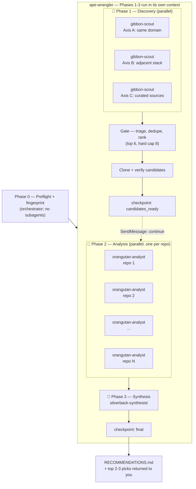

# ape

Imitation is the sincerest form of engineering. Apes techniques from open-source GitHub repos into your codebase: parallel gibbon discovery → metadata gate → shallow clones → parallel orangutan deep analysis → silverback synthesis — the whole expedition run by one ape-wrangler subagent so the orchestrator's context only ever sees the fingerprint and the final recommendations.

## Workflow



## Components

| Component | File | Purpose |
|-----------|------|---------|
| Command | `commands/forage.md` | `/ape:forage [focus]` — Phase 0 (fingerprint) itself, then hands Phases 1–3 to the ape-wrangler |
| Command | `commands/clean.md` | `/ape:clean [--all]` — sanctioned deletion of clones (keeps reports) |
| Agent | `agents/ape-wrangler.md` | sonnet, full tool access — runs discovery, triage/rank, cloning, analysis, and synthesis inside its own context, resumed via SendMessage across two segments (`candidates_ready`, `final`). The field researcher who dispatches the troop and carries the findings out. |
| Agent | `agents/gibbon-scout.md` | haiku, `Bash` only — gh search + metadata triage, one axis each, hard 5-search budget. Brachiates fast across many candidates, never stops to read code. |
| Agent | `agents/orangutan-analyst.md` | sonnet, `Read/Grep/Glob/Bash/Write` — one repo each, budgeted read order, ≤400-word report to disk, 3-line return. Sits alone with one repo until it really understands it. |
| Agent | `agents/silverback-synthesist.md` | opus, `Read/Glob/Write` — reads every report plus the fingerprint itself, writes the ranked `RECOMMENDATIONS.md`, and returns only the top picks. The troop leader everyone reports back to. |
| Script | `scripts/init-workspace.sh` | Phase 0 helper — creates the workspace and reports whether a fingerprint already exists, as one command. |
| Script | `scripts/clone-candidates.sh` | Gate-phase helper — clones the selected candidates in the background and returns only a log tail. |
| Script | `scripts/search-repos.sh` | gibbon-scout's Phase 1 helper — runs several `gh search` queries as one command. |
| Script | `scripts/triage-repos.sh` | gibbon-scout's Phase 1 helper — runs several `gh repo view` metadata checks as one command instead of a shell for-loop. |
| Script | `scripts/readme-peek.sh` | gibbon-scout's Phase 1 helper — peeks at one repo's README as one command instead of a multi-stage pipe chain. |

## Install

Drop this directory into your plugin marketplace repo and add an entry:

```json
{ "name": "ape", "source": "./ape", "description": "Forage OSS repos for transferable techniques" }
```

## Usage

```
/ape:forage testing        # focus the run
/ape:forage                # broad: architecture, testing, DX
/ape:clean               # delete clones, keep fingerprint + reports
/ape:clean --all         # full wipe
```

All artifacts land in `~/tmp/repo-research/<project-dir-name>/`:
`fingerprint.md` (cached ≤30 days), `candidates.md`, `repos/`, `reports/*.md`, `RECOMMENDATIONS.md`. Reports persisting on disk means you can re-run synthesis, or argue with a ranking, without re-foraging.

## Design rationale

- **Model inversion**: discovery is mechanical (queries + metadata) → haiku; analysis is where value is generated (extracting non-obvious transferable patterns from unfamiliar code) → sonnet. This costs more than haiku-analysis in absolute dollars because analysis is where the tokens flow — deliberately.
- **Fingerprint once, inject everywhere**: subagents don't inherit parent context; without this, N agents each re-characterise the project inconsistently. The already-in-use list stops agents recommending what you already have. The fingerprint is shown to you before dispatch because a wrong fingerprint produces convergent garbage at scale.
- **Axis-split discovery**: identical fan-out prompts converge on the same top-starred repos. Three gibbons with orthogonal axes buys coverage, not duplication.
- **Context hygiene**: orangutans write full reports to disk and return three lines. Eight analysts returning prose would blow the orchestrator's synthesis budget. Synthesis carries this all the way through: the silverback reads every report itself and hands the orchestrator only a finished top-2–3 pitch — the orchestrator's context never absorbs the ~3,000+ words of raw report bodies that reading eight reports directly would cost.
- **Parallelism spent where it pays**: one analyst per repo, all dispatched in one message. Claude Code runs parallel tasks up to a cap (~10 in current builds; extras queue), so waves are sized to fit.
- **Opus for synthesis, not analysis**: the silverback is the one place a wrong call is expensive — it's the last filter before a recommendation reaches the user, weighing convergent/conflicting analyst findings against the fingerprint in one shot with no chance to course-correct downstream. That judgment call gets the strongest model in the pipeline.
- **One wrangler, two checkpoints**: dispatching 3 scouts, then N analysts, then a synthesist directly from the orchestrator means every one of those dispatch/completion events narrates into the orchestrator's own context — the exact noise the per-agent context-hygiene points above are trying to avoid, just one layer up. The `ape-wrangler` runs Phases 1–3 in its own context and only ever hands back two compact JSON checkpoints (`candidates_ready`, `final`), the same pattern `imps:imp-wrangler` uses for its integration phase.

## Known wrinkles

- All multi-command bash (workspace init, backgrounded cloning, gibbon-scout's batched `gh search`/`gh repo view` calls and README pipe chain) is bundled into `scripts/*.sh` specifically because Claude Code's permission analyzer can't statically verify a compound/multi-line bash block (a for-loop, a multi-stage pipe, several sequential commands) against an `allowed-tools` prefix — it prompts regardless of whether every sub-command would individually match. A single script invocation with args, by contrast, is a plain matchable command.
- `allowed-tools` in `commands/forage.md` only pre-approves the orchestrator's own Phase 0 script/`gh` calls. It does **not** extend into the `Task`-dispatched `ape-wrangler` or the agents it in turn dispatches (`gibbon-scout`, `orangutan-analyst`, `silverback-synthesist`, `clone-candidates.sh`) — those run under the ambient permission system, so they'll still prompt once per session unless you add your own rule, e.g. in `.claude/settings.json`:
- orangutan-analyst's repo exploration hits a related but distinct guardrail: `cd <repo-path> && <cmd>` is specifically flagged for manual approval every time (path-traversal protection), independent of whether `<cmd>` itself would otherwise match a permission rule. Its instructions tell it to pass `<repo-path>` as an argument instead of `cd`-ing in, and to prefer the `Grep`/`Glob` tools (already granted, no `cd` involved) over Bash `grep`/`find` for content search. Unlike gibbon-scout's fixed, bounded `gh` calls, an analyst's exploration is genuinely open-ended per repo, so it isn't a candidate for the same fixed-script treatment.
  ```json
  { "permissions": { "allow": ["Bash(/absolute/path/to/.claude/plugins/cache/seankoji/ape/*)"] } }
  ```
  Claude Code's permission matcher only supports a *trailing* wildcard on a literal prefix, not a mid-path glob — since the installed version number sits before `scripts/<name>.sh` in the path, the rule has to cover the whole `ape/` cache directory (any version, any file) rather than pinning to one script name.
- `disable-model-invocation` is a recent command frontmatter key (keeps Claude from auto-firing a 10-agent burn mid-session via the SlashCommand tool). Unknown keys are ignored, so it's harmless on older builds.
- GitHub's search API budget (~30 req/min) is shared across all three scouts; each is capped at 5 searches and told to back off on 403 rather than hammer.
- Cowork's plugin tooling treats `commands/` as legacy in favour of `skills/*/SKILL.md`. For Claude Code orchestration with `$ARGUMENTS`, a command is still the right shape; if you ever port this to Cowork, move the `forage.md` body into a SKILL.md.
- Discovery decays: rerunning next quarter tends to resurface the same repos. The durable asset is the analyst + fingerprint pattern; refresh axis C's curated sources rather than adding scouts.
