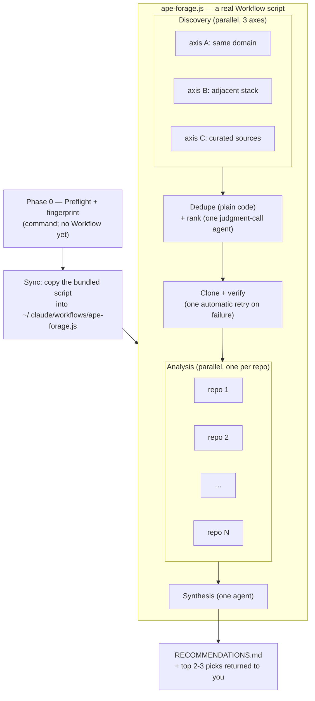

# ape

Imitation is the sincerest form of engineering. Apes techniques from open-source GitHub repos into your codebase: discovery across three axes → a ranking judgment call → shallow clones → per-repo deep analysis → synthesis — the whole expedition run as one `Workflow` script so the orchestrator's context only ever sees the fingerprint and the final recommendations.

## Prerequisites

| Requirement | Needed for |
| --- | --- |
| **`gh` CLI** (authenticated) | Discovery and clone phases (`gh search`, `gh repo view`, `gh repo clone`). `/ape:forage` runs `gh auth status` at Phase 0 and stops if unauthenticated. |
| **The `Workflow` tool** | **Hard dependency — no fallback.** `/ape:forage` syncs `scripts/ape-forage.workflow.js` into `~/.claude/workflows/` and invokes it; if `Workflow` is unavailable, the command has nothing to run. |

## How it runs



A plugin cannot ship a runnable Workflow directly — `.js` workflows only load from a
user's own `~/.claude/workflows/`. So `/ape:forage` re-syncs the bundled canonical copy
there on every run (a plain overwrite, always matching the installed plugin version) and
then invokes it. This replaces the old `ape-wrangler` + 4 themed subagents + a hand-rolled
JSON-checkpoint/`SendMessage`-resume protocol (duplicated from `imps`) with real
`pipeline()`/`parallel()` control flow — dedupe, the survivor-count checks, and the
one-shot clone retry are actual code now, not prose trusted to be followed correctly.

## Components

| Component | File | Purpose |
|-----------|------|---------|
| Command | `commands/forage.md` | `/ape:forage [focus]` — Phase 0 (fingerprint) itself, syncs the Workflow script, invokes it, and presents the result |
| Command | `commands/clean.md` | `/ape:clean [--all]` — sanctioned deletion of clones (keeps reports) |
| Workflow script | `scripts/ape-forage.workflow.js` | The canonical orchestration — discovery, dedupe, ranking, clone+retry, analysis, synthesis. Synced into `~/.claude/workflows/ape-forage.js` before each run. |
| Script | `scripts/init-workspace.sh` | Phase 0 helper — creates the workspace and reports whether a fingerprint already exists, as one command. |
| Script | `scripts/clone-candidates.sh` | Clone helper, called from inside the Workflow script — clones the selected candidates in the background and returns only a log tail. |
| Script | `scripts/search-repos.sh` | Discovery helper — runs several `gh search` queries as one command. |
| Script | `scripts/triage-repos.sh` | Discovery helper — runs several `gh repo view` metadata checks as one command instead of a shell for-loop. |
| Script | `scripts/readme-peek.sh` | Discovery helper — peeks at one repo's README as one command instead of a multi-stage pipe chain. |

## Install

Drop this directory into your plugin marketplace repo and add an entry:

```json
{ "name": "ape", "source": "./ape", "description": "Forage OSS repos for transferable techniques" }
```

## Usage

```
/ape:forage testing        # focus the run
/ape:forage                # broad: architecture, testing, DX
/ape:clean               # delete clones, keep fingerprint + reports
/ape:clean --all         # full wipe
```

All artifacts land in `~/tmp/repo-research/<project-dir-name>/`:
`fingerprint.md` (cached ≤30 days), `repos/`, `reports/*.md`, `RECOMMENDATIONS.md`. Reports persisting on disk means you can re-run synthesis, or argue with a ranking, without re-foraging.

**Note:** `/ape:forage` invokes the `Workflow` tool, which runs in the background — the
command's turn ends once the expedition is dispatched, and you're notified automatically
when it completes (discovery + ranking + cloning + analysis + synthesis all happen in
that one background run). This is a different interaction shape from a synchronous
command, but the same one the built-in `/deep-research`-style workflows already use.

## Design rationale

- **Model inversion**: discovery is mechanical (queries + metadata) → haiku; the ranking judgment call and per-repo analysis are where value is generated → sonnet. This costs more than haiku-analysis in absolute dollars because analysis is where the tokens flow — deliberately.
- **Fingerprint once, inject everywhere**: every agent call in the workflow gets the fingerprint as a plain argument — without this, each one would re-characterise the project inconsistently. The already-in-use list stops agents recommending what you already have. The fingerprint is shown to you before the Workflow ever runs, because a wrong fingerprint produces convergent garbage at scale.
- **Axis-split discovery**: identical fan-out prompts converge on the same top-starred repos. Three axes with orthogonal search guidance buys coverage, not duplication.
- **Mechanical steps are plain code, judgment steps are agent calls**: deduping candidates by name, counting survivors against the "fewer than 2 → blocked" thresholds, and computing the sparse-clone flag from disk size are ordinary JavaScript in the workflow script — no model call, no chance of prose drift. Only the steps that genuinely need judgment (which repos are worth the tokens to clone, what a report means for this project) go to an `agent()` call.
- **Context hygiene**: analysts write full reports to disk and return three lines each. Eight analysts returning prose directly to the orchestrator would blow its context budget. Synthesis carries this through: the synthesis agent reads every report itself and returns only a finished top-2–3 pitch to the workflow's caller — the command's context never absorbs the raw report bodies reading eight reports directly would cost.
- **Opus for synthesis, not analysis**: synthesis is the one place a wrong call is expensive — the last filter before a recommendation reaches the user, weighing convergent/conflicting findings against the fingerprint in one shot with no chance to course-correct downstream. That judgment call gets the strongest model in the pipeline.
- **One retry, not an interactive resume**: a clone failure doesn't need a human decision, so the workflow retries the failed subset once automatically rather than requiring a round-trip back to the user (the old design's "retry clone" `SendMessage` verb). If it still fails, the result surfaces the failed list and the fix (auth/rate-limit/disk space) is on the user before re-running the whole command — cheap, since the fingerprint is cached.

## Known wrinkles

- All multi-command bash (workspace init, backgrounded cloning, discovery's batched `gh search`/`gh repo view` calls and README pipe chain) is bundled into `scripts/*.sh` specifically because Claude Code's permission analyzer can't statically verify a compound/multi-line bash block (a for-loop, a multi-stage pipe, several sequential commands) against an `allowed-tools` prefix — it prompts regardless of whether every sub-command would individually match. A single script invocation with args, by contrast, is a plain matchable command.
- `allowed-tools` in `commands/forage.md` only pre-approves the command's own Phase 0 script/`gh` calls and the workflow-sync `cp`. It does **not** extend into the agents the Workflow script spawns internally — those run under the ambient permission system, so they'll still prompt once per session unless you add your own rule, e.g. in `.claude/settings.json`:
  ```json
  { "permissions": { "allow": ["Bash(/absolute/path/to/.claude/plugins/cache/seankoji/ape/*)"] } }
  ```
  Claude Code's permission matcher only supports a *trailing* wildcard on a literal prefix, not a mid-path glob — since the installed version number sits before `scripts/<name>.sh` in the path, the rule has to cover the whole `ape/` cache directory (any version, any file) rather than pinning to one script name.
- The per-repo analysis agent's exploration hits a related but distinct guardrail: `cd <repo-path> && <cmd>` is specifically flagged for manual approval every time (path-traversal protection), independent of whether `<cmd>` itself would otherwise match a permission rule. Its prompt tells it to pass `<repo-path>` as an argument instead of `cd`-ing in, and to prefer the `Grep`/`Glob` tools over Bash `grep`/`find` for content search.
- `disable-model-invocation` is a recent command frontmatter key (keeps Claude from auto-firing a background-heavy run mid-session via the SlashCommand tool). Unknown keys are ignored, so it's harmless on older builds.
- GitHub's search API budget (~30 req/min) is shared across all three discovery agents; each is capped at 5 searches and told to back off on 403 rather than hammer.
- Discovery decays: rerunning next quarter tends to resurface the same repos. The durable asset is the analysis + fingerprint pattern; refresh axis C's curated sources rather than adding more discovery agents.
- The synced `~/.claude/workflows/ape-forage.js` is an implementation detail of `/ape:forage`, not a documented standalone entry point — running it directly (bypassing the command) skips the fingerprint gate and Phase 0 argument assembly.
